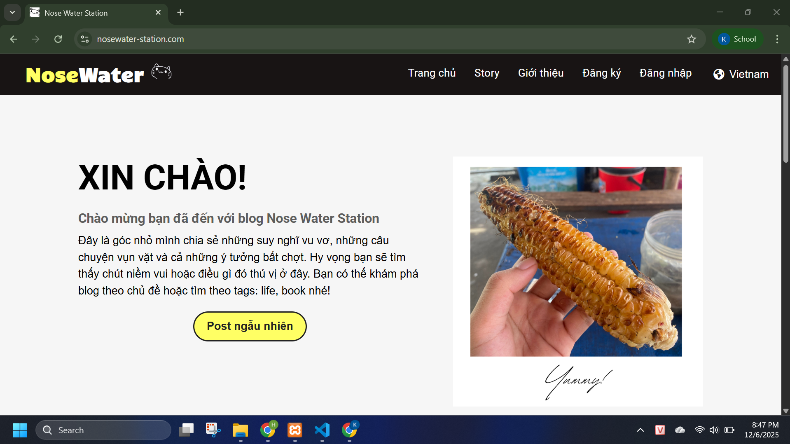
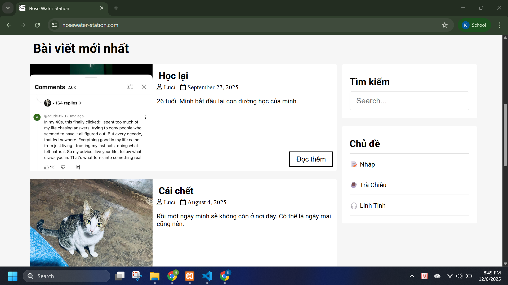
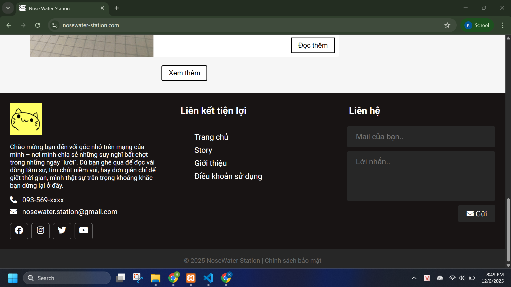
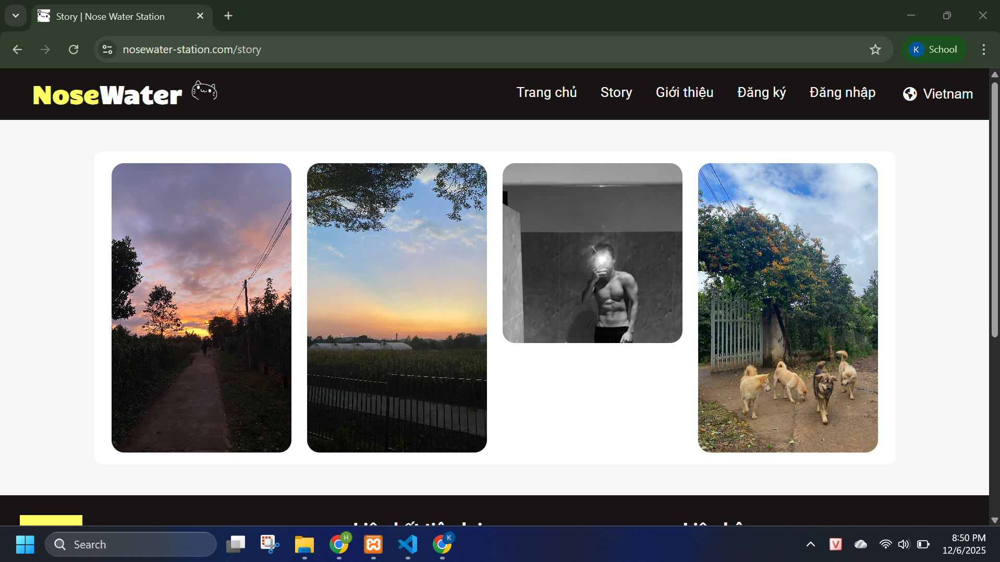
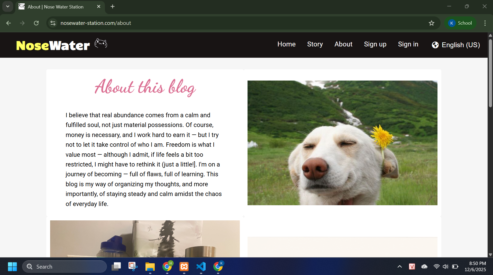
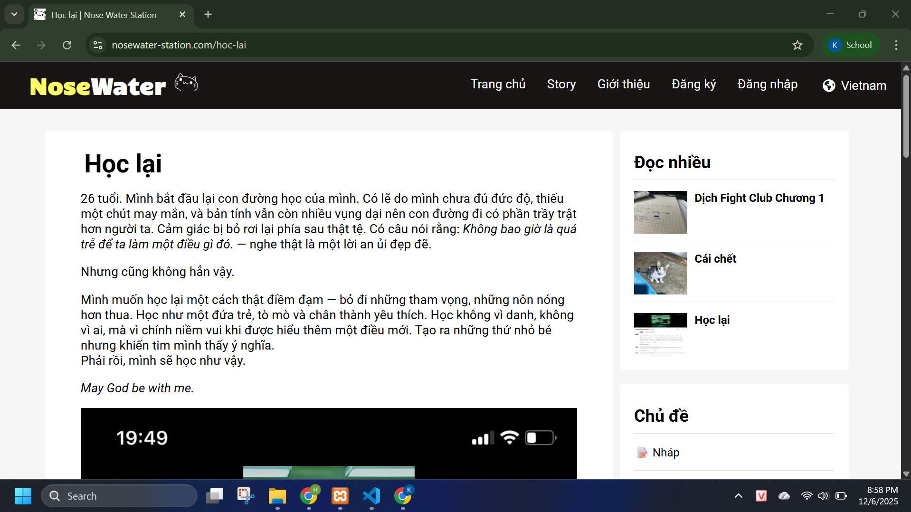

# Nose Water Station

A personal blog project built for fun, learning, and the occasional existential crisis.

Welcome to **Nose Water Station**, a small but mighty PHP-based blog created during the legendary days when its author was bored, curious, and dangerously motivated at the same time.

This project includes full source code for a custom blog system — from the admin panel to post management, comments, authentication, and more. Everything is coded manually using pure **PHP, MySQL, HTML, CSS, and JS** (no frameworks, just vibes 😎).

---

## ✨ Features

- Create, edit, and delete posts
- Topic & category management
- User login & registration
- Admin dashboard
- Comment system (with anti-spam logic)
- Image upload support
- Multi-page frontend (Home, About, Single post, Contact…)

---

## 📁 Project Structure

```
nose-water-station/
│
├── admin/                 # Admin dashboard (CRUD posts, users, topics, etc.)
│
├── app/                   # Core PHP logic, controllers, helpers
│
├── assets/                # CSS, JS, images
│
├── PHPMailer-master/      # Email library for contact form
│
├── vendor/                # Composer dependencies
│
├── .gitignore
├── .htaccess
├── composer.json
├── composer.lock
│
├── index.php              # Homepage
├── about.php              # About page
├── single.php             # Single post page
├── contact_process.php    # Contact form handling
├── config.php             # Database connection config
│
└── …other PHP pages
```

---

## 🛠️ Tech Stack

- PHP
- MySQL
- HTML / CSS / JavaScript
- PHPMailer
- Composer
- No fancy frameworks — handcrafted like a bowl of Vietnamese noodle soup 🍜

---

## 🤔 Why "Nose Water Station"?

Because sometimes life hits so hard that your nose runs like a broken faucet…  
and you still choose to code.  
Beautiful. Inspirational. Relatable. 😌

---

## 📬 Contact

This project is open for feedback, ideas, or just random compliments.

- GitHub: https://github.com/khoahdinh
- Email: **khoa.hdinh@gmail.com**

_Status:_ constantly learning & vibing.

---

## 📝 Notes

This is a personal learning project. Expect improvements, refactors, and new features as the developer levels up through coffee, LeetCode, and pure stubbornness.

---

## 📸 Screenshots

Here are some screenshots from the Nose Water Station blog:

- Home

## 

- Home

## 

- Footer

## 

- Story

## 

-

## 

-

## 
